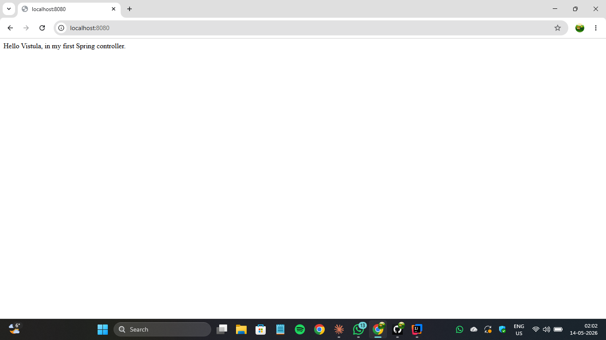
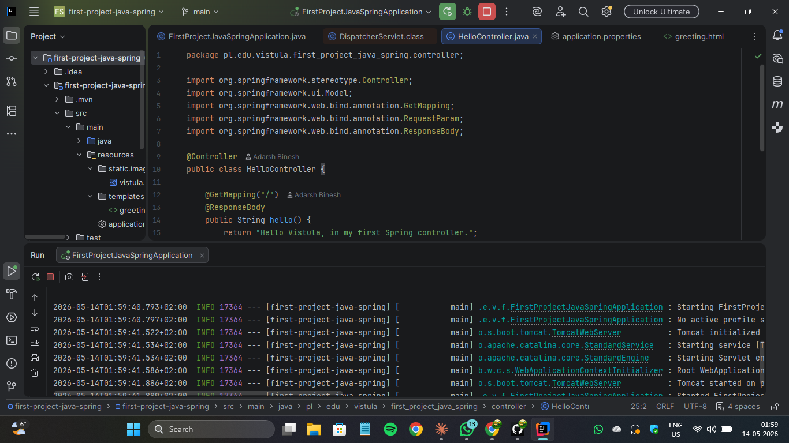
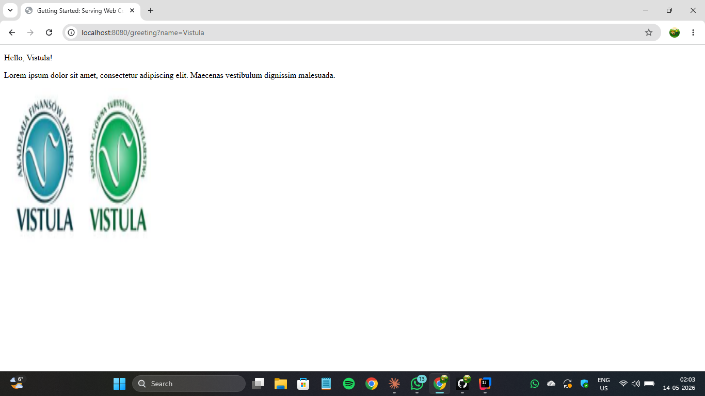

# 🌱 Spring Boot Task 1 – MVC Application

This project is a simple Spring Boot application created as part of Task 1
for the Spring Framework / Java course.

The purpose of the project is to understand the basics of Spring Boot,
controllers, HTTP requests, and rendering views.

---

## 📌 Project Overview

The application demonstrates:

- How to create a Spring Boot project
- How to write the first Spring controller
- How to handle HTTP GET requests
- How to use `@ResponseBody`
- How to render an HTML page using Thymeleaf
- How to display a static image

---

## ✅ Application Features

- Plain text response returned from a controller
- HTML page rendered using Thymeleaf
- Follows the MVC (Model–View–Controller) pattern
- Static image served from the `static` directory
- Runs locally on port `8080`

---

## 🌐 Available Endpoints

### ✅ GET `/`

- **URL:** `http://localhost:8080/`
- **Method:** GET
- **Response:** `Hello Vistula, in my first Spring controller.`

---

### ✅ GET `/greeting`

- **URL:** `http://localhost:8080/greeting?name=Vistula`
- **Method:** GET
- **Response:** HTML page with greeting and Vistula logo image

---

## ▶ How to Run

1. Clone the repository
2. Open in IntelliJ IDEA
3. Run `FirstProjectJavaSpringApplication`
4. Open browser at `http://localhost:8080`

---

## ✅ Screenshots

